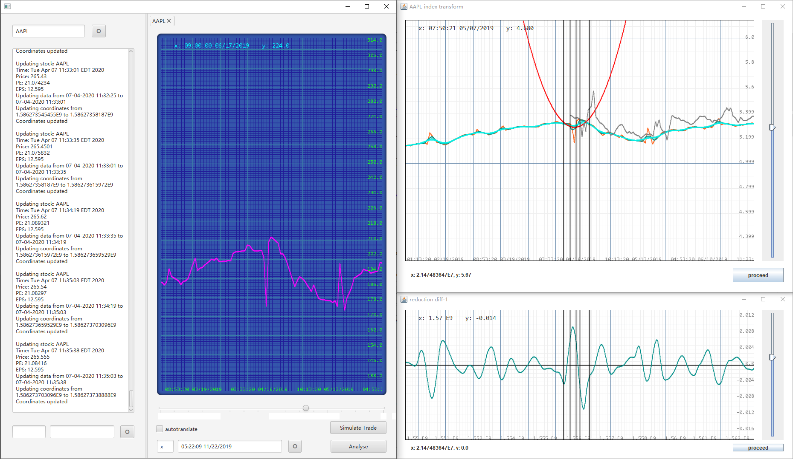
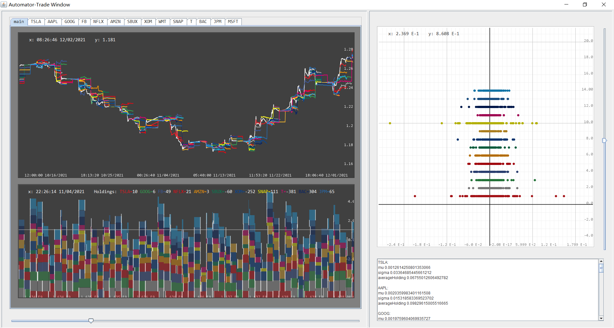
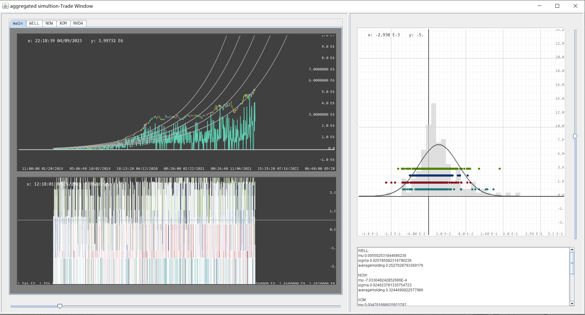
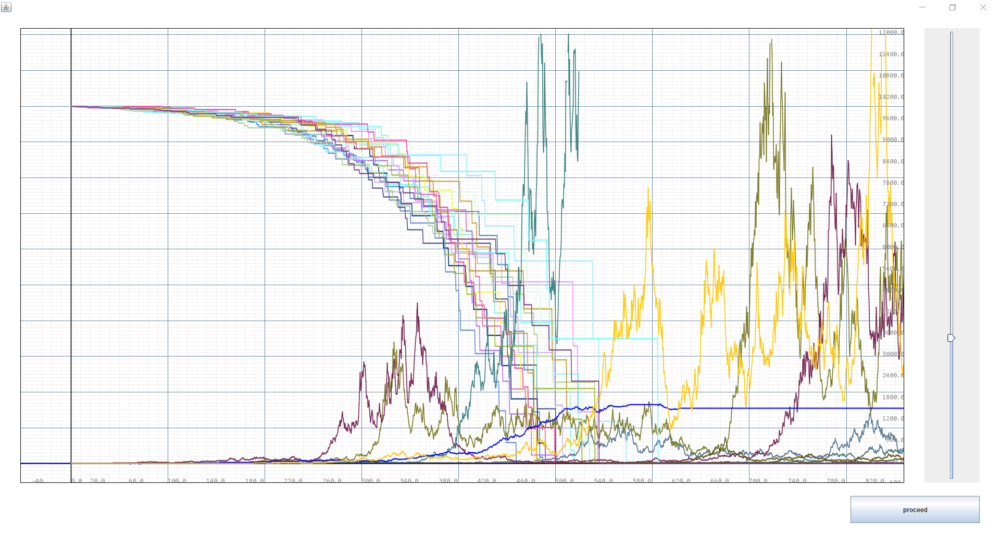

# Stock Terminal
A comprehensive platform in Java (14k source) for performing stock analysis, covering real-time database, multi-threaded strategy pipeline, backtesting, brokerage simulation, automated-trading, accounting validation, time-frame quantization. Built with database pipelines that retrieves up to 3 years of minute-mark historical data for any US stock, sourcing from multiple data APIS.

## Terminal Entry

## Strategy Pipeline

## Backtesting

## Strategy Analysis

Testing strategies that operate in an effective market.
